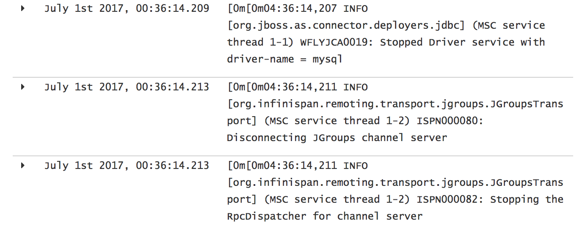
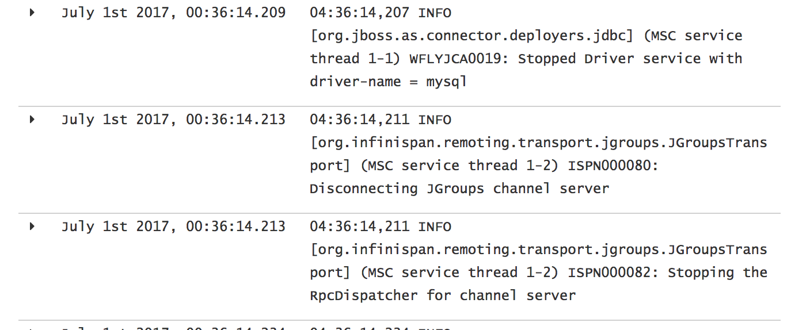

kibana-ansi
============

[Kibana](https://www.elastic.co/products/kibana) field formatter to strip ANSI codes

**Before**



**After**



## Installation

### Standalone Installation

Execute the following command to install the plugin into a standalone Kibana instance

```
$ bin/kibana plugin plugin --install sabre1041/kibana-ansi
```

### OpenShift Container Platform Installation

The assets from this plugin can be integrated into OpenShift's [Aggregated Logging](https://docs.openshift.com/container-platform/latest/install_config/aggregate_logging.html) facility.

First clone the repository:

```
$ git clone https://github.com/sabre1041/kibana-ansi
$ cd kibana-ansi
```

Login to an OpenShift environment with privileges to modify the _logging_ project (or whichever contains the Aggregated Logging framework).

```
$ oc login
$ oc project
```

Create a [ConfigMap](https://docs.openshift.com/container-platform/latest/dev_guide/configmaps.html) containing the plugin assets

```
$ oc create configmap kibana-ansi --from-file=index.js --from-file=package.json --from-file=public/ansi.js
```

Patch the Kibana DeploymentConfig to mount the ConfigMap's previously configured

```
oc patch dc/logging-kibana -p '{"spec":{"template":{"spec":{"volumes":[{"name":"kibana-ansi-type","configMap":{"name":"kibana-ansi","items":[{"key":"ansi.js","path":"ansi.js"}],"defaultMode":420}},{"name":"kibana-ansi-index","configMap":{"name":"kibana-ansi","items":[{"key":"index.js","path":"index.js"}],"defaultMode":420}},{"name":"kibana-ansi-package","configMap":{"name":"kibana-ansi","items":[{"key":"package.json","path":"package.json"}],"defaultMode":420}}],"containers":[{"name":"kibana","volumeMounts":[{"name":"kibana-ansi-index","mountPath":"/usr/share/kibana/installedPlugins/kibana-ansi/index.js","subPath":"index.js"},{"name":"kibana-ansi-type","mountPath":"/usr/share/kibana/installedPlugins/kibana-ansi/public/ansi.js","subPath":"ansi.js"},{"name":"kibana-ansi-package","mountPath":"/usr/share/kibana/installedPlugins/kibana-ansi/package.json","subPath":"package.json"}]}]}}}}'
```

## Configuration

Once the plugin has been installed, the field formatter can be applied to an index.

Select **Settings** and under **Indices**, select the desired *Index Patterns*. 

Search for the field that would be used to apply the formatter and select the *edit* icon under the *Controls* column (Note: The plugin currently only supports the *string* type).

In the *Format* dropdown, select **ANSI**

Click **Update Field** to apply the changes. 

  
